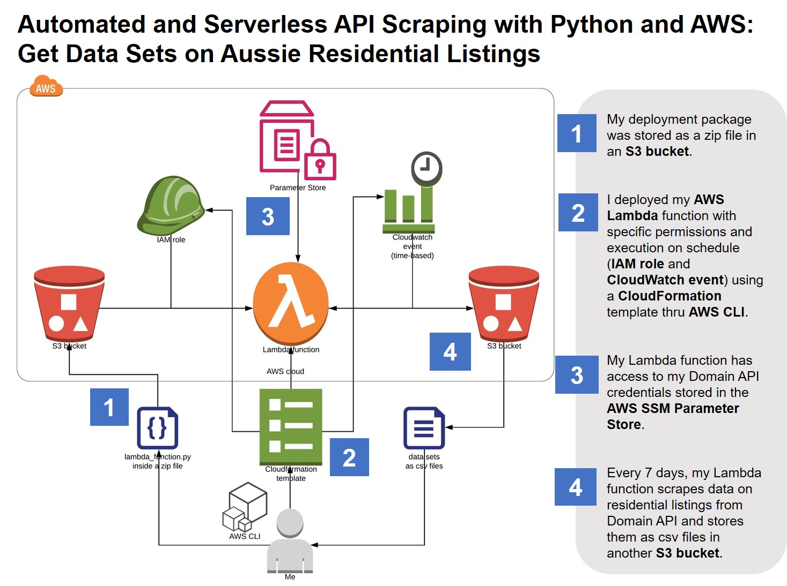

# Automated and Serverless API Scraping with Python and AWS: Get Data Sets on Aussie Residential Listings

I created a Lambda function in Amazon Web Services (AWS) that runs on a schedule to collect information on Aussie residential listings from the [Domain Application Programming Interface (API)](https://developer.domain.com.au/) and store it as `csv` data sets in a Simple Storage Service (S3) bucket. I wrote the Lambda function in Python and deployed it in the AWS cloud with specific permissions and schedule of execution (IAM role and CloudWatch event) thru AWS Command Line Interface (CLI). My Lambda function has access to my Domain API credentials stored in the AWS Systems Manager (SSM) Parameter Store. This project follows the architectural diagram shown below. The data sets are in long format and suitable for data analytics and visualization. 

## Getting Started

These instructions will get you a copy of the project up and running on your AWS account for development and testing purposes. See deployment for notes on how to deploy the project on the AWS cloud.

### Prerequisites 

The following are needed to deploy the project on the AWS cloud:

* Create a [developer account at Domain](https://developer.domain.com.au/docs/getting-started) and start a new project. Take note of your OAuth credentials (`Client Id` and `Client Secret`).
* Sign up for an [AWS account](https://aws.amazon.com/free/). It is free and will give you access to the `AWS Free Tier` services.
* (Optional) Install the [AWS CLI](https://docs.aws.amazon.com/cli/latest/userguide/install-windows.html). Aside from the AWS CLI, you can create and deploy AWS resources using the AWS Management Console. 
* Store your OAuth credentials (`Client Id` and `Client Secret`) as string parameters in the cloud using [AWS SSM Parameter Store](https://docs.aws.amazon.com/cli/latest/reference/ssm/put-parameter.html).
* Prepare your [deployment package as a zip file](https://docs.aws.amazon.com/lambda/latest/dg/lambda-python-how-to-create-deployment-package.html)(`lambda.zip`). The deployment package contains the following:

	* Python script of the Lambda function (`lambda_function.py`). In the script, you will need to edit the following: names of your OAuth parameters stored in the AWS SSM Parameter Store; `suburb` list and contents of the `payload` function if you are interested in residential listings for sale on other Aussie states; name of the S3 bucket where you want to save your data sets; and folder and file names of your data set files. Check `lambda_function.ipynb` for a detailed discussion of the code. 
	* Dependencies for `pandas`, `numpy`, and `requests` Python modules. I built the dependencies using an Amazon Linux 2 AMI (Amazon Machine Image) in an AWS Elastic Compute Cloud (EC2) instance. I deployed the [EC2 instance using AWS CLI](https://medium.com/@corymaklin/tutorial-amazon-web-services-part-1-create-virtual-machines-with-aws-cli-b900702bf286) and used [PuTTY for connection](https://docs.aws.amazon.com/AWSEC2/latest/UserGuide/putty.html). I then [installed Python 3.8.1 and pip](https://computingforgeeks.com/how-to-install-python-on-3-on-centos/). I used [FileZilla to transfer `lambda_function.py` to my EC2 instance](https://www.zyxware.com/articles/5133/how-to-connect-to-amazon-ec2-using-filezilla). With `lambda_function.py` inside the new directory `lambda`, I pip-installed the modules, zipped the contents, and transfered the created `lambda.zip` back to my local Windows machine.  

* [Create two S3 buckets in the AWS cloud](https://docs.aws.amazon.com/cli/latest/reference/s3/mb.html): one for receiving your deployment package ('lambda.zip') and another for storing your `csv` data sets. 
* [Copy `lambda.zip` into your S3 bucket](https://docs.aws.amazon.com/cli/latest/reference/s3/cp.html). Take note of the name of the S3 bucket and the S3 key (filename of the deployment package) that you provided in the copy operation. 

## Deployment

To deploy the Lambda function in the AWS cloud:

* Prepare the CloudFormation template (see `my1studacityproj.yml`). In the template, I have defined a Lambda function (`AWS::Lambda::Function`) called `PullListings`, specified the handler (`Python_filename.function_name`), indicated the source of the code (S3 bucket name and S3 key), and stated the runtime (`python3.8`) and timeout (`300` seconds). I have also attached the execution role `PullListingsRole` in the deployment of the Lambda function.

	`PullListingRole` was also defined in the template (`AWS::IAM:Role`) which provides specific permissions to the Lambda function. The entity `lambda.amazonaws.com` was allowed to access AWS services and resources using temporary security credentials (`sts:AssumeRole`). Policies were also attached to this role: `AWSLambdaBasicExecutionRole` to create log groups and streams, and put events into log streams (CloudWatch Logs permissions); `AmazonS3FullAccess` to read and write to the S3 bucket assigned to store the `csv` data sets; and `ssm_read` to access the variables stored in the Parameter Store. 

	The template also has an event rule (`AWS::Events::Rule`) which executes the Lambda function every 7 days. This event rule needs permission to invoke the Lambda function (`AWS::Lambda::Permission`) which was also written in the CloudFormation template. 
	
* [Create the CloudFormation stack](https://docs.aws.amazon.com/cli/latest/reference/cloudformation/create-stack.html). I used script files (`create.sh`, `update.sh`) in creating and updating the stack in the bash terminal.  

	
